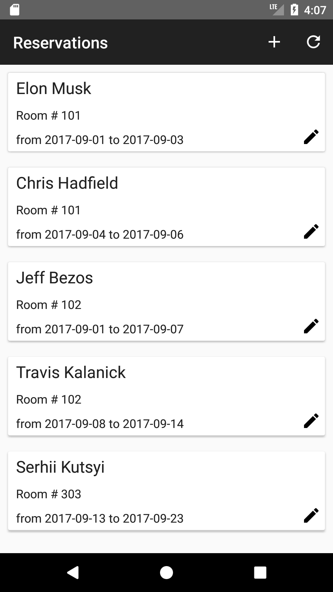
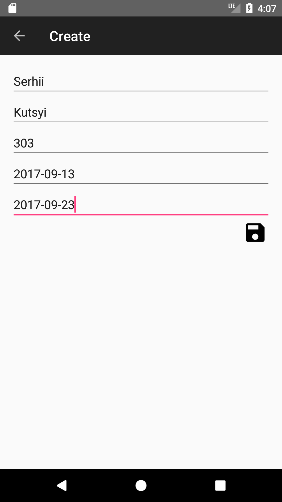
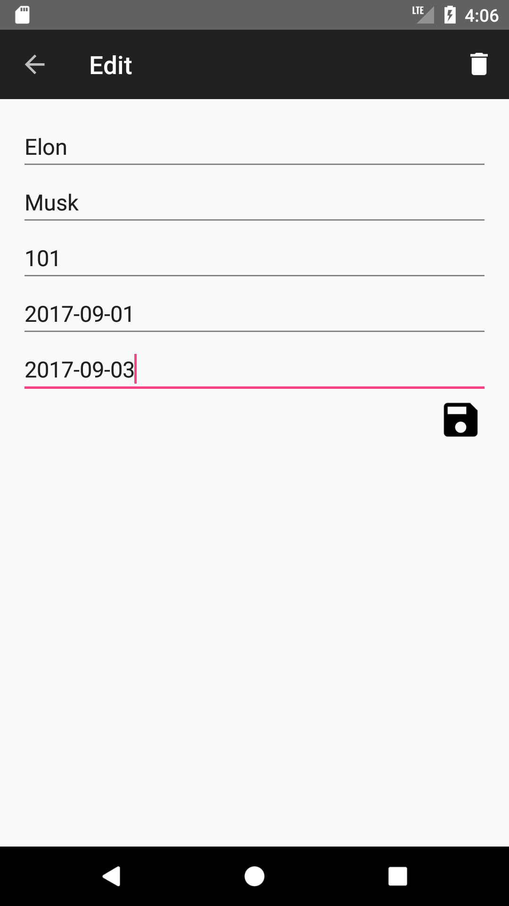

# Reservation Android Application

This is a sample android application for the [Reservation RESTful Web Service](https://github.com/serhiikutsyi/reservation-service).
The Reservation service is running on [Heroku](https://reservation-service-demo.herokuapp.com/) and exposes several REST API endpoints.
For more details please refer to the [GitHub repository](https://github.com/serhiikutsyi/reservation-service) or investigate REST API with [Swagger UI](https://reservation-service-demo.herokuapp.com/swagger-ui.html).

  
  
  

